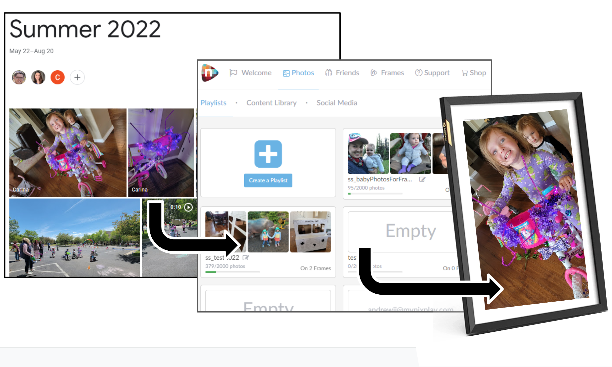

Picsync
=======

[](https://goreportcard.com/report/github.com/andrewjjenkins/picsync)


This syncs pictures from Google Photos albums to Nixplay Seed wifi-enabled picture
frames.



Installation
------------

You can get the latest build as a container:

```
docker pull gcr.io/picsync-build/github.com/andrewjjenkins/picsync:master-latest
```

or you can build it locally (go 1.17):

```
git clone https://github.com/andrewjjenkins/picsync
cd picsync
go build ./cmd/picsync
./picsync --help
```

Setup
-----

There are two config files:
- *picsync.yaml*: General config and synchronizing rules.
- *.picsync-credentials.yaml*: Credentials to download/upload photos.

You should treat the credentials file as a secret and not share it with
anyone.  If you accidentally leak it, you should de-authorize the Picsync
app from your accounts and then re-setup.

A picsync.yaml file says what to sync where.  You list the target albums
(in Nixplay) and then describe what the source(s) for those albums.  Once
picsync is running, then those target albums will always be kept up-to-date
with what is in the sources.  See [picsync.yaml](picsync.yaml) for details.

```yaml
# List each target album you want to sync to in Nixplay.
# Picsync will:
#   1. Create the album (if it doesn't exit)
#   2. Upload all photos from each source into the album.
#   3. Delete all photos in the album not in any source.
#   4. Create/update a playlist called "ss_<album.name>", containing the
#      photos from that album.
albums:
# This will create/update the nixplay album named "test2022", and
# create/update the nixplay playlist called "ss_test2022"
- name: AllMyStuff
  # A list of sources to pull images from.
  sources:
    googlephotos:
    - <ID for a googlephotos album>
  # If true, do not actually do anything, just report what would be done.
  #dryRun: true
  # If false, do not delete photos from nixplay albums (we only add)
  #delete: false
  # If true, force publishing the playlist even if nothing has changed.  This
  # can help fix issues if the nixplay albums or playlists get corrupted.
  #forcePublish: true

# Repeat the sync every interval forever, rather than running once and exiting.
# Can be any string parseable by time.ParseInterval
# Some examples:
# every: 10m
every: 1h

# Serve prometheus-compatible metrics
prometheus:
  # Listen on port 1971 on every interface
  listen: ":1971"
```

The easiest way to create the .picsync-credentials.yaml file is to run
`picsync googlephotos login`.  This will give you a URL you should open in
a browser where you're signed in to google, and ask you to authorize the
Picsync app to *read-only* access to your Google Photos data.  Once you
authorize it, the app will print out what you should put into the .picsync-credentials.yaml file.  (You can avoid printing the details to the 
console using `picsync googlephotos login -o .picsync-credentials.yaml`).

You should add a block to this with your username/password for Nixplay.

When complete it will look like:

```yaml
# Keep this file confidential.
# If you lose it, de-authorize nixplay-sync from your Google Photos account and repeat 'picsync googlephotos login'
nixplay:
  username: "helloworld"
  password: "changeme"

googlephotos:
  access:
    token_type: "Bearer"
    access_token: "..."
    refresh_token: "..."
    expiry: "2022-09-21..."
```

Listing
-------
As a trial run and to discover the API ID for the Google Photo source albums,
you can run `picsync googlephotos list`, which will print the albums you have:

```
$ picsync googlephotos list
Album "Seattle":
  ID: AP5WpWre...
  Items: 5
  Google Photos: https://photos.google.com/lr/album/AP5WpWre...
Album "xmasphoto":
  ID: AP5WpWoif...
  Items: 1
  Google Photos: https://photos.google.com/lr/album/AP5WpWoif...
```

(the ID and URL have been truncated in the above example).

The ID is what you need to fill in the sources.  For instance, if I wanted to sync both the "Seattle" and "xmasphoto" albums to my frame, my picsync.yaml would look like:

```yaml
albums:
  name: AllMyStuff
  sources:
    googlephotos:
    - AP5WpWre...
    - AP5WpWoif...
```

You can also list the photos in a particular album using `picsync googlephotos list <albumID>`:

```
Media Item "IMG_20140225_072829.jpg":
  Google Photos ID: AP5WpWod...
  Description: Space Needle from my hotel window
  Google Photos: https://photos.google.com/lr/album/AP5WpWre.../photo/AP5WpWod...
  Raw: https://lh3.googleusercontent.com/lr/...
  ```

Running
-------

Once you have setup, just run it:

```
picsync sync
```

This will sync all photos from the source albums to the 
destination album.

If an album of that name doesn't exist in Nixplay, you need to create it (just go
to https://app.nixplay.com/#/albums/nixplay/ and do "Create an album").

Nixplay also has a concept of Playlist (formerly known as 
Slideshow), which would let you pick parts of an album without deleting the whole
album or do other tricks.  We don't need any of that, but we have to have a playlist
because that is the only thing you can actually load onto a Nixplay frame.  So we 
make a playlist/slideshow called "ss_<albumName>" and automatically sync the album
into the playlist.  So, for the above example, the Nixplay album is called 
`AllMyStuff` and the Nixplay playlist is called "ss_AllMyStuff".

Go to https://app.nixplay.com/#/frames/ and click on a frame, then click "Enable
Playlist" for `ss_Nixplay Album` and it should automatically sync.

Looping
-------

You can cause the syncer to run periodically by setting the "every" property in picsync.yaml:

```yaml
albums:
- name: AllMyStuff
  sources:
    googlephotos:
    - <ID for a googlephotos album>

# Repeat the sync every interval forever, rather than running once and exiting.
# Can be any string parseable by time.ParseInterval
# Some examples:
# every: 10m
# every: 1h
every: 1h
```

Caching
-------

Google provides a stable ID for each photo, but does not directly provide any
sort of hash of the contents via API.  Nixplay does provide an MD5 for each photo
in an album via the API.

We create a scratch file `picsync-metadata-cache.db` that is an SQLite database
containing a cache of Google photo IDs and the hashes of the photos they refer to.
This means each time we loop, we only need to download photos in the albums that
we've never seen before.

We currently use the MD5 hash because it is the only thing available directly in
the Nixplay API.  We assume you are not using us to protect against attackers
using your credentials to put hash-colliding photos into your Nixplay account
(you should use a good password instead!).

You don't need to do anything to initialize `picsync-metadata-cache.db`, and if
you remove it, we'll re-create it automatically when we first run.

Monitoring
----------

If you are in the long-running mode (using "every 1h" or similar), then you can
also specify a port to serve prometheus metrics on:

```yaml
prometheus:
  # Listen on port 1971 on every interface
  listen: ":1971"

  # Listen on port 20000 but only loopback IPv4
  #listen: "127.0.0.1:20000"
```

These metrics are currently reported at "/metrics":

```
# HELP cache_entries_googlephotos Number of entries in the googlephotos cache
# TYPE cache_entries_googlephotos gauge
cache_entries_googlephotos 485
# HELP cache_entries_nixplay Number of entries in the nixplay cache
# TYPE cache_entries_nixplay gauge
cache_entries_nixplay 385
# HELP cache_get_hits_googlephotos Number of gets that were found in the cache
# TYPE cache_get_hits_googlephotos counter
cache_get_hits_googlephotos 379
# HELP cache_get_hits_nixplay Number of gets that were found in the cache
# TYPE cache_get_hits_nixplay counter
cache_get_hits_nixplay 0
# HELP cache_get_misses_googlephotos Number of gets that were not found in the cache
# TYPE cache_get_misses_googlephotos counter
cache_get_misses_googlephotos 0
# HELP cache_get_misses_nixplay Number of gets that were not found in the cache
# TYPE cache_get_misses_nixplay counter
cache_get_misses_nixplay 0
# HELP cache_upserts_insert_googlephotos Number of upserts that were inserts (not found in the cache)
# TYPE cache_upserts_insert_googlephotos counter
cache_upserts_insert_googlephotos 0
# HELP cache_upserts_insert_nixplay Number of upserts that were inserts (not found in the cache)
# TYPE cache_upserts_insert_nixplay counter
cache_upserts_insert_nixplay 0
# HELP cache_upserts_update_googlephotos Number of upserts that were updates (found in the cache)
# TYPE cache_upserts_update_googlephotos counter
cache_upserts_update_googlephotos 379
# HELP cache_upserts_update_nixplay Number of upserts that were updates (found in the cache)
# TYPE cache_upserts_update_nixplay counter
cache_upserts_update_nixplay 0
```

along with the usual goproc and prometheus built-in metrics


Running in Kubernetes
---------------------

You can run picsync as a pod in Kubernetes.

First you must run `picsync googlecloud login -o .picsync-credentials.yaml` to
set credentials.

```
kubectl create ns picsync
kubectl create configmap -n picsync picsync --from-file=picsync.yaml=./picsync.yaml
kubectl create secret -n picsync generic picsync-credentials --from-file=.picsync-credentials.yaml=./.picsync-credentials.yaml
kubectl apply -n picsync k8s/deployment.yaml
```

Comparison to Nixplay Built-In
------------------------------

At the time this project was started, Nixplay didn't have functionality to pull 
from SmugMug or Google Photos.  There is now a built-in Google Photos integration.

However, it wants access to all your google photos data, and I wanted to limit its 
scope to read-only, and ideally read-only of just particular albums for security.  
As well, you can see clearly that picsync is doing nothing nefarious with any of
the photo data (just really simple reads from Google Photos), and all the
credentials stay on your system.

I had a lot of trouble ever getting any of the built-in dynamic album functionality
to work with Google Photos (though that was a few years ago).  This may not be
a relevant complaint anymore.

In short, you may find that the Nixplay webapp does everything you need, you're
comfortable with their security and handling of Google tokens, and
this project is just a historic curiousity :-).

Roadmap/Help Wanted
-------------------
1. Instructions on creating the Google Photos App API Client ID
1. Getting the app generally approved so that users don't have to bring their own API client ID
1. Create album in Nixplay if it doesn't exist already.

License
-------
Copyright 2018 Andrew Jenkins <andrewjjenkins@gmail.com>

Licensed under the terms of the Apache 2.0 license (see LICENSE)
