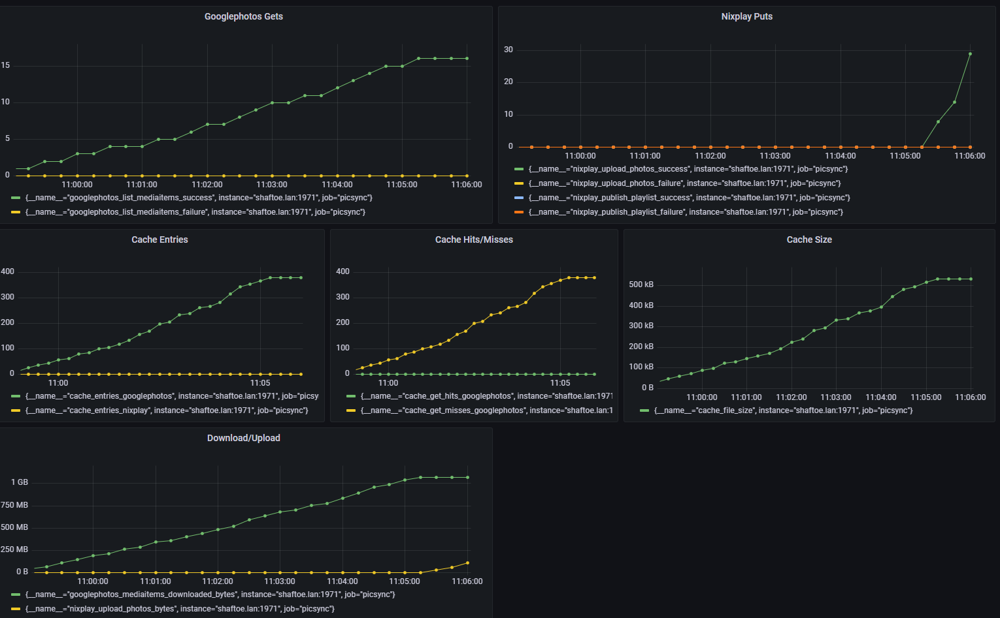

These metrics are currently reported at "/metrics":

```
# HELP cache_entries_googlephotos Number of entries in the googlephotos cache
# TYPE cache_entries_googlephotos gauge
cache_entries_googlephotos 474
# HELP cache_entries_nixplay Number of entries in the nixplay cache
# TYPE cache_entries_nixplay gauge
cache_entries_nixplay 0
# HELP cache_file_size Size of the cache database in bytes
# TYPE cache_file_size gauge
cache_file_size 659456
# HELP cache_get_hits_googlephotos Number of gets that were found in the cache
# TYPE cache_get_hits_googlephotos counter
cache_get_hits_googlephotos 0
# HELP cache_get_hits_nixplay Number of gets that were found in the cache
# TYPE cache_get_hits_nixplay counter
cache_get_hits_nixplay 0
# HELP cache_get_misses_googlephotos Number of gets that were not found in the cache
# TYPE cache_get_misses_googlephotos counter
cache_get_misses_googlephotos 474
# HELP cache_get_misses_nixplay Number of gets that were not found in the cache
# TYPE cache_get_misses_nixplay counter
cache_get_misses_nixplay 0
# HELP cache_upserts_insert_googlephotos Number of upserts that were inserts (not found in the cache)
# TYPE cache_upserts_insert_googlephotos counter
cache_upserts_insert_googlephotos 474
# HELP cache_upserts_insert_nixplay Number of upserts that were inserts (not found in the cache)
# TYPE cache_upserts_insert_nixplay counter
cache_upserts_insert_nixplay 0
# HELP cache_upserts_update_googlephotos Number of upserts that were updates (found in the cache)
# TYPE cache_upserts_update_googlephotos counter
cache_upserts_update_googlephotos 0
# HELP cache_upserts_update_nixplay Number of upserts that were updates (found in the cache)
# TYPE cache_upserts_update_nixplay counter
cache_upserts_update_nixplay 0
# HELP googlephotos_access_token_valid_time_remaining Number of seconds the access token is valid for (negative if expired)
# TYPE googlephotos_access_token_valid_time_remaining gauge
googlephotos_access_token_valid_time_remaining 724
# HELP googlephotos_list_albums_failure Failed calls to list the user's albums
# TYPE googlephotos_list_albums_failure counter
googlephotos_list_albums_failure 0
# HELP googlephotos_list_albums_success Successful calls to list the user's albums
# TYPE googlephotos_list_albums_success counter
googlephotos_list_albums_success 0
# HELP googlephotos_list_mediaitems_count Total number of media items from all calls to list
# TYPE googlephotos_list_mediaitems_count counter
googlephotos_list_mediaitems_count 474
# HELP googlephotos_list_mediaitems_failure Failed calls to list all media items in an album
# TYPE googlephotos_list_mediaitems_failure counter
googlephotos_list_mediaitems_failure 0
# HELP googlephotos_list_mediaitems_success Successful calls to list all media items in an album
# TYPE googlephotos_list_mediaitems_success counter
googlephotos_list_mediaitems_success 20
# HELP googlephotos_mediaitems_downloaded_bytes Total bytes of all media item downloads
# TYPE googlephotos_mediaitems_downloaded_bytes counter
googlephotos_mediaitems_downloaded_bytes 1.322378632e+09
# HELP googlephotos_mediaitems_downloaded_failure Number of media items that were downloaded but encountered an error
# TYPE googlephotos_mediaitems_downloaded_failure counter
googlephotos_mediaitems_downloaded_failure 0
# HELP googlephotos_mediaitems_downloaded_success Number of media items that were downloaded
# TYPE googlephotos_mediaitems_downloaded_success counter
googlephotos_mediaitems_downloaded_success 474
# HELP nixplay_create_playlist_failure Failed creation of playlist
# TYPE nixplay_create_playlist_failure counter
nixplay_create_playlist_failure 0
# HELP nixplay_create_playlist_success Successful creation of playlist
# TYPE nixplay_create_playlist_success counter
nixplay_create_playlist_success 0
# HELP nixplay_delete_photo_failure Failures when deleting photo
# TYPE nixplay_delete_photo_failure counter
nixplay_delete_photo_failure 0
# HELP nixplay_delete_photo_success Photos deleted successfully
# TYPE nixplay_delete_photo_success counter
nixplay_delete_photo_success 0
# HELP nixplay_get_album_by_name_failure Failed calls to get an album by name
# TYPE nixplay_get_album_by_name_failure counter
nixplay_get_album_by_name_failure 0
# HELP nixplay_get_album_by_name_success Successful calls to get an album by name
# TYPE nixplay_get_album_by_name_success counter
nixplay_get_album_by_name_success 2
# HELP nixplay_get_albums_failure Failed calls to list the user's albums
# TYPE nixplay_get_albums_failure counter
nixplay_get_albums_failure 0
# HELP nixplay_get_albums_success Successful calls to list the user's albums
# TYPE nixplay_get_albums_success counter
nixplay_get_albums_success 2
# HELP nixplay_get_photos_failure Failed calls to get photos in an album
# TYPE nixplay_get_photos_failure counter
nixplay_get_photos_failure 0
# HELP nixplay_get_photos_photo_count Total count of photo metadata received
# TYPE nixplay_get_photos_photo_count counter
nixplay_get_photos_photo_count 948
# HELP nixplay_get_photos_success Successful calls to get photos in an album
# TYPE nixplay_get_photos_success counter
nixplay_get_photos_success 4
# HELP nixplay_get_playlist_by_name_failure Failed calls to get an playlist by name
# TYPE nixplay_get_playlist_by_name_failure counter
nixplay_get_playlist_by_name_failure 0
# HELP nixplay_get_playlist_by_name_success Successful calls to get an playlist by name
# TYPE nixplay_get_playlist_by_name_success counter
nixplay_get_playlist_by_name_success 2
# HELP nixplay_get_playlists_failure Failed calls to list the user's playlists
# TYPE nixplay_get_playlists_failure counter
nixplay_get_playlists_failure 0
# HELP nixplay_get_playlists_success Successful calls to list the user's playlists
# TYPE nixplay_get_playlists_success counter
nixplay_get_playlists_success 2
# HELP nixplay_publish_playlist_failure Failed calls to publish a playlist
# TYPE nixplay_publish_playlist_failure counter
nixplay_publish_playlist_failure 0
# HELP nixplay_publish_playlist_success Successful calls to publish a playlist
# TYPE nixplay_publish_playlist_success counter
nixplay_publish_playlist_success 0
# HELP nixplay_upload_photos_bytes Total count of bytes of photos successfully uploaded
# TYPE nixplay_upload_photos_bytes counter
nixplay_upload_photos_bytes 0
# HELP nixplay_upload_photos_failure Failed uploads of photos
# TYPE nixplay_upload_photos_failure counter
nixplay_upload_photos_failure 0
# HELP nixplay_upload_photos_success Successful uploads of photos
# TYPE nixplay_upload_photos_success counter
nixplay_upload_photos_success 0
```

along with the usual goproc and prometheus built-in metrics.


Grafana
-------
Here is an example of some of those metrics shown in Grafana:




Expected Behavior
-----------------

In the normal case, you should not see any `*_failure` metrics increase.  If you
see a few, you may be able to conclude they're just transient network issues.
Picsync does not immediately retry a resync if it encounters a failure, it will
still sleep the `every` period, so you may need to force-restart it if you
encounter an issue and want to clear it up before waiting an hour.

Here is a general description of what you should expect to see during operation:

### First-time startup

You will see a slow stream of googlephotos_list_mediaitems_success as we
populate the cache of md5s.  Each get is the metadata for 25 pictures (by
default) and we'll download each one and compute its md5.

You will see googlephotos_download_bytes increase, basically limited by network
bandwidth / how fast the photos can be downloaded.

Also the cache_get_misses_googlephotos will increase, 1 for each photo, since
every photo is a miss (we haven't seen it before).

### Bulk sync

If you've never run this before, then this will happen on the first run, just
after the previous phase.  This will also happen if you aren't running picsync
continuously and make a bunch of changes, or if you add a new album to
picsync.yaml.

This phase is an upload of a bunch of photos.  You'll see
googlephotos_download_bytes increase, and nixplay_upload_photos_bytes increase,
pretty close to identically (there's a little wrapper for the nixplay upload
that adds a few bytes).  You'll see nixplay_upload_photos_success increment
repeatedly, and you should see nixplay_publish_playlist_success increment once
for each nixplay album.

### Steady State

This happens when things are synchronized or close.  In this phase, every
`every` period (in picsync.yaml), something like 1h or so recommended, the
syncer runs and finds nothing to do.

Every `every` period, you'll see googlephotos_list_mediaitems_success go up.  It
will increment by approximately `ceil(totalPhotosAcrossAllSources/25)`.  In the
steady case, all or nearly all photos will be ones we've already seen, so you
will see cache_get_hits_googlephotos increment.

If there are a few misses, you will see googlephotos_mediaitems_downloaded_bytes
increment, and then you will see cache_file_size and cache_entries_googlephotos
increase (as we record the md5s of the new photos into the cache).  Then you'll
see nixplay_upload_photos_success increase and finally an increment of
nixplay_publish_playlist_success as we publish the few new photos.

If there are no new photos, and no removed photos, then you will not see
nixplay_upload_photos_success or nixplay_publish_playlist_success (unless
`forcePublish: true`).

In the steady state, no photos are downloaded or uploaded, and the
googlephotos_mediaitems_downloaded_bytes and nixplay_upload_photos_bytes will be
steady.  We just periodically download the album info from google, find all the
photos in our cache, download the album info from nixplay, find that they match
and go back to sleep.

### Google Photos Auth Token

The `googlephotos_access_token_valid_time_remaining` records how much longer the
short-lived access token is valid for.  This token is automatically refreshed
(using the refresh token in `.picsync-credentials.yaml`), and generally
shouldn't need intervention.

You should see `googlephotos_access_token_valid_time_remaining` shoot up to
about an hour or so at start, and then it will trickle down towards zero, before
being refreshed (shoot back up to an hour), and then trickle down and so on.

If `googlephotos_access_token_valid_time_remaining` becomes and remains
negative, there is a problem.  The refresh token may have expired or been
invalidated.  You should run `picsync googlephotos login` again and get a new
token.
